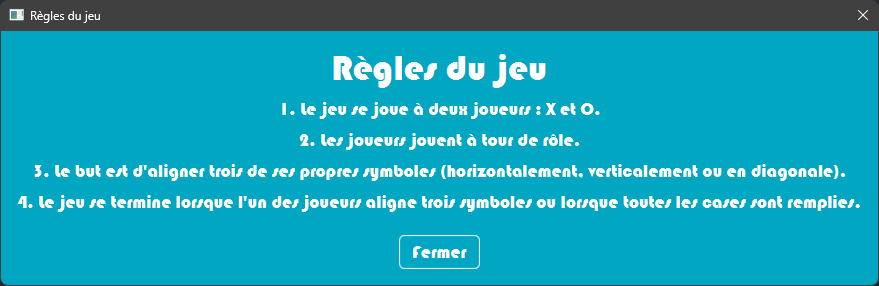

# Tic-Tac-Toe in Java

## Table of Contents
1. [Introduction](#introduction)
2. [Requirements](#requirements)
3. [About the Project](#about-the-project)
4. [How to Play](#how-to-play)
5. [How to Run](#how-to-run)
6. [Todo](#todo)
7. [Screenshots](#screenshots)
8. [Issues](#issues)
9. [Contributing](#contributing)
10. [License](#license)

## Introduction

This is a simple Tic-Tac-Toe game written in Java. It is a two-player game, where each player takes turns to place their symbol (X or O) on a 3x3 grid. The first player to get three of their symbols in a row (horizontally, vertically, or diagonally) wins the game. If all the cells are filled and neither player has three in a row, the game is a draw.

## Requirements

- Java 8 or higher
- IntelliJ IDEA
- JavaFX 11.0.2 or higher
- Scene Builder 11.0.0 or higher

## About the Project

The game is implemented using the Model-View-Controller (MVC) design pattern. The model that contains the game logic. The view that contains the game's GUI. The controller that contains the event handlers for the GUI.

The game is played on a 3x3 grid. Each grid cell is a button. When a player clicks on a button, the player symbol is displayed on the button. The game ends when a player gets three of their symbols in a row (horizontally, vertically or diagonally), or when all cells are filled and no player has three in a row. The game can be restarted by clicking the "Play Again" button.

## How to Play

1. Run the application.
2. Add play with your friend.

If you don't have any friends, you can play against a bot. To do this, you just have to go to the settings and change the number of players.

## How to Run

1. Clone the repository.
2. Open the project in IntelliJ IDEA.
3. Run the application.
4. Enjoy!

## Todo

Mandatory features:

- [x] Title on each window
- [x] Multiple windows (modal and non-modal)
- [x] Menu bar with options to reset the game, view game rules, and quit the game
- [ ] Ability to name the players
- [x] Choice of starting player
- [x] Game area with 9 squares
- [x] Display of the player's symbol on each click
- [ ] Indication of the current player
- [x] End of game with announcement of the winner or a draw
- [x] Interface to replay or quit the game
- [x] Scoreboard showing the number of wins for each player

Optional features:

- [x] Highlighting of the winning alignment
- [ ] Use of images for symbols
- [x] Customization of symbols
- [ ] Permanent scoreboard accessible from the menu
- [x] "Single player" mode to play against the computer with different levels
- [ ] Ability to choose the grid size for playing variations with 16 squares, 25 squares, or more
- [ ] Generate a JAR file for the application and add it to the archive. This format allows for publishing Java applications to end users.

## Screenshots

  </a>
  </a>

  </a>

## Issues

Please report specific issues, bugs, or feature requests in our issue tracker.

## Contributing

Contributions are what make the open source community an amazing place to learn, inspire, and create. Any contributions you make are greatly appreciated.

1. Fork the project.
2. Create your feature branch (`git checkout -b feature/AmazingFeature`).
3. Commit your changes (`git commit -m 'Add some AmazingFeature'`).

## License

Distributed under the GNU General Public License v3.0. See `LICENSE` for more information.

